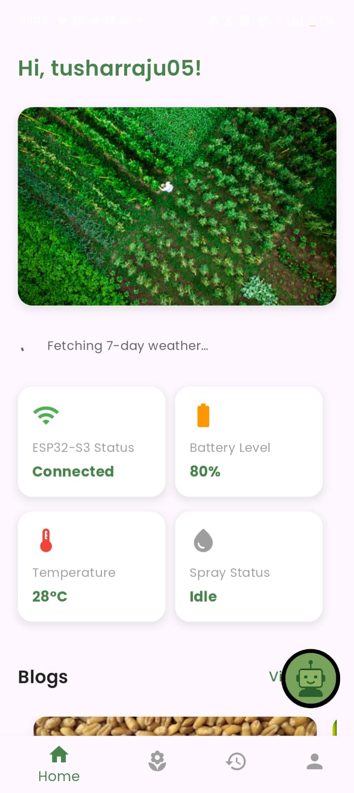
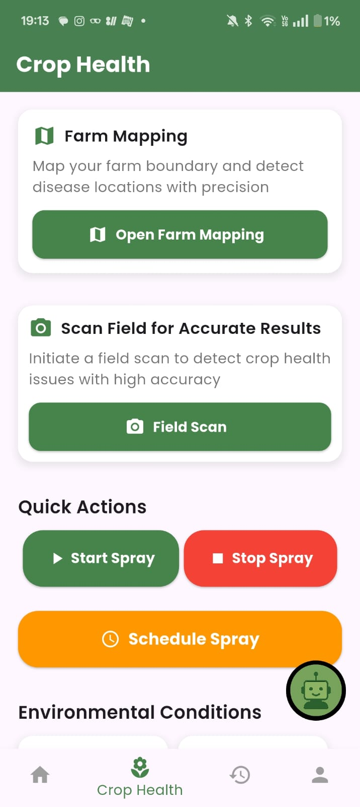
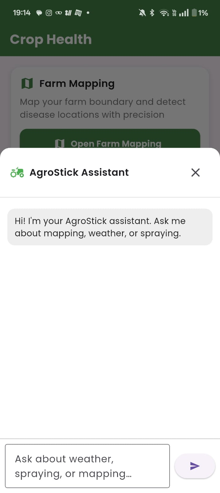
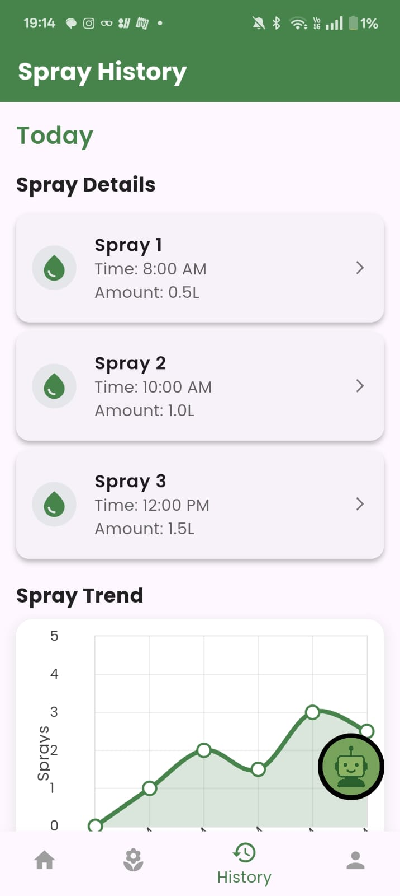

# AgroStick 🌾

**AI-Powered Precision Pesticide Spraying Upgrade for Smart Farming**

AgroStick is an **AI-driven precision pesticide spraying add-on** designed as an upgrade to the existing AgroStick platform. It enables farmers to **detect crop diseases and pest infestations in real time** and spray pesticides **only where required**, drastically reducing chemical usage, cost, and environmental harm.

The system transforms AgroStick from a monitoring tool into a **complete precision farming solution**, combining sensing, vision, and targeted action in a single handheld device.

---

## 🚀 Problem Statement

Traditional pesticide spraying in agriculture faces serious challenges:

* Blanket spraying wastes **40–60% of chemicals**
* Overuse of pesticides damages **soil health and crop quality**
* Farmers lack real-time visibility into **where infestation actually exists**
* Manual inspection is **time-consuming and inaccurate**
* High chemical exposure risks farmer health
* Rising costs of pesticides reduce profit margins

As a result:

* Input costs increase
* Crop quality deteriorates
* Environmental damage rises
* Farmers spray more but achieve less

---

## 💡 Solution: AgroStick

AgroStick introduces a **vision-based, AI-powered precision spraying module** that attaches seamlessly to the original AgroStick as an **upgrade add-on**.

Instead of spraying entire fields, the system:

* Detects diseased or pest-affected crop regions in real time
* Activates a **smart nozzle** to spray only the affected area
* Minimizes chemical use while maximizing effectiveness

This upgrade makes AgroStick **actionable**, not just informative.

---

## 📸 Product Screenshots

  
  

  
  

  
  

## 🧠 How AgroStick Works

### 1. Crop Scanning

* Built-in camera scans crops continuously
* Captures leaf-level images during movement
* Works in real field conditions

### 2. AI Detection

* Computer vision model identifies:

  * Pest attacks
  * Disease symptoms
  * Leaf damage patterns
* Differentiates healthy vs affected areas

### 3. Precision Spraying

* Smart nozzle activates only when infection is detected
* Spray intensity and duration are controlled automatically
* No unnecessary chemical discharge

### 4. Seamless Integration

* Attaches as an **add-on module** to AgroStick
* Uses shared power and control interface
* No redesign of the base device required

---

## 📊 Key Features

* **Precision Pesticide Spraying:** Spray only where needed
* **Chemical Reduction:** Up to 50% lower pesticide usage
* **Cost Savings:** Reduced recurring chemical expenses
* **Crop Health Improvement:** Prevents over-spraying damage
* **Farmer Safety:** Less chemical exposure
* **Plug-and-Play Upgrade:** Easy attachment to AgroStick
* **Field-Ready Design:** Lightweight and handheld

---

## 🧩 Technical Architecture

* **Vision Module:** Camera-based crop monitoring
* **AI Engine:**

  * Disease & pest detection model
  * Real-time inference
* **Control System:**

  * Smart nozzle trigger logic
  * Spray timing and control
* **Hardware Integration:**

  * Mechanical add-on mount
  * Power and data shared with AgroStick
* **Output:**

  * Targeted pesticide spray
  * Optional mobile/app feedback

---

## 🌱 Target Users

* Small & marginal farmers
* Precision agriculture practitioners
* Organic and sustainable farming initiatives
* Agricultural research & pilot farms
* Government and NGO-led agri programs

---

## 📈 Impact & Business Value

* **Input Cost Reduction:** Lower pesticide consumption
* **Higher Yield Quality:** Healthier crops, better produce
* **Environmental Protection:** Reduced soil & water contamination
* **Scalable Adoption:** Upgrade existing AgroStick units
* **Farmer-Friendly:** No technical expertise required

---

## 🌍 Market Opportunity

* Global pesticide market exceeds **$60B annually**
* Increasing push toward **precision and sustainable farming**
* Government incentives for **chemical reduction**
* Rapid adoption of **AI in agriculture**

AgroStick positions itself as a **low-cost precision spraying solution** accessible even to small farmers.

---

## 🎯 Vision

**AgroStick aims to make precision agriculture affordable, practical, and scalable.**

By upgrading existing AgroStick devices with AI-powered action, the platform enables farmers to:

* Spray less
* Save more
* Grow healthier crops
* Protect the environment

---

## 📌 Note

This repository represents a **prototype / concept upgrade module** developed for hackathons and innovation challenges, showcasing the feasibility of AI-driven precision pesticide spraying using an add-on approach.

---

## 🙌 Thank You

Thank you for exploring **AgroStick 2.0** 🌾
Together, let’s move toward **smarter farming and cleaner agriculture** 🚜🌱
